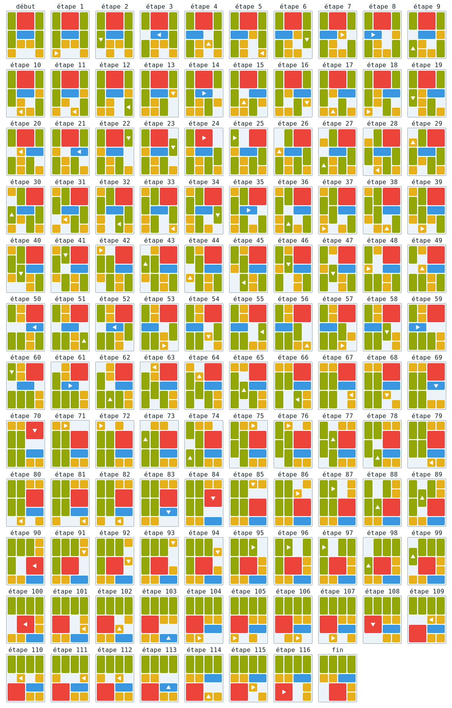

__[FR] ●__ Ce dépôt contient trois implémentations (en C++20, en Python (*work in progress*)
et en [Go][hp-golang] (*work in progress*)) d'un algorithme de recherche exhaustive
(avec optimisations) permettant de déterminer la solution minimale (c.-à-d. utilisant
le minimum de déplacements) d'une grille de [Klotski][wk-klotski].

Le résultat en sortie est un fichier SVG affichant la solution étape par étape,
similaire à ce qui suit :



### Construire et exécuter l'implémentation en C++
Aucune bibliothèque ni dépendance externe n'est requise, un compilateur C++ prenant
en charge le standard C++20 suffira (notamment l'entête `<format>`).

Sous Linux, après avoir cloné le dépôt :
```
$ cd c++/
$ make
$ ./klotski_solver.prg
```
Cela génèrera un fichier `c++/klotski_solution.svg`, pouvant être visionné avec une
visionneuse d'images ou un navigateur web.

Sur d'autres plateformes, il suffira de compiler le fichier `c++/klotski_solver.cpp`
pour construire le binaire à exécuter.

---

__[EN] ●__ This repository contains three implementations (in C++20, Python (*work in progress*),
and [Go][hp-golang] (*work in progress*)) of an exhaustive search algorithm (with many optimizations)
that finds the shortest solution (i.e. with the minimum amount of moves) of a [Klotski][wk-klotski] grid.


### Build and run the C++ implementation
No dependency or external library is required.  A C++ compiler supporting C++20 is
all that is needed (in particular, the `<format>` header must be present).

On Linux, after cloning the repository:
```
$ cd c++/
$ make
$ ./klotski_solver.prg
```
This will generate an SVG image in `c++/klotski_solution.svg`, viewable using any
standard image viewer or web browser.

On other platforms, simply compile `c++/klotski_solver.cpp` to generate an executable
binary.

[hp-golang]: https://golang.org/
[wk-klotski]: https://en.wikipedia.org/wiki/Klotski
